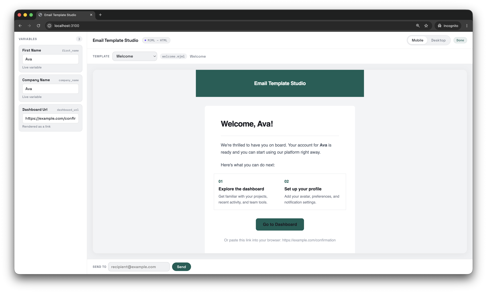

# Email Template Studio

[](https://github.com/reynoldputra/email-template-studio/actions)
[](LICENSE)

Local-first MJML email template workspace. Clone it, edit templates in `src/`, preview live in the browser, build to HTML.



## Quickstart

```bash
git clone https://github.com/reynoldputra/email-template-studio.git my-emails
cd my-emails
npm install
npm run dev
```

Open <http://127.0.0.1:3100>.

## Features

- **MJML authoring** — `mj-include` partials and shared styles
- **Variable extraction** — `{{ expression }}` placeholders parsed automatically into typed metadata
- **Live preview** — desktop and phone modes, re-renders on variable edit
- **Test send** — over SMTP, recipient configurable per-send
- **Build** — compile every template to `dist/<id>.html`
- **Validate** — project structure and template syntax checks

## Project layout

```text
src/
├── pages/          your email templates (.mjml)
├── components/     reusable partials (header, footer, …)
└── styles/         shared style includes

.studio/            tooling engine (ignore unless hacking)
dist/               compiled HTML output (gitignored)
email-template-studio.config.ts
.env.example
```

Edit files in `src/`. The `.studio/` folder holds the engine — you don't need to touch it.

## Commands

| Command | What it does |
|---|---|
| `npm run dev` | Start studio at <http://127.0.0.1:3100> |
| `npm run build` | Compile all templates → `dist/` |
| `npm run validate` | Check project structure + template syntax |
| `npm test` | Run unit tests |
| `npm run test:e2e` | Run browser tests |

## Variables

Any `{{ expression }}` in a template becomes a variable. The studio extracts them automatically and shows input fields for preview.

## Test sending

Copy `.env.example` to `.env` and fill in SMTP credentials. For local testing use [Ethereal](https://ethereal.email/) or [MailHog](https://github.com/mailhog/MailHog). Never commit `.env`.

## Contributing

Contributions welcome. See [CONTRIBUTING.md](CONTRIBUTING.md) for engine development notes.

## License

[MIT](LICENSE)
