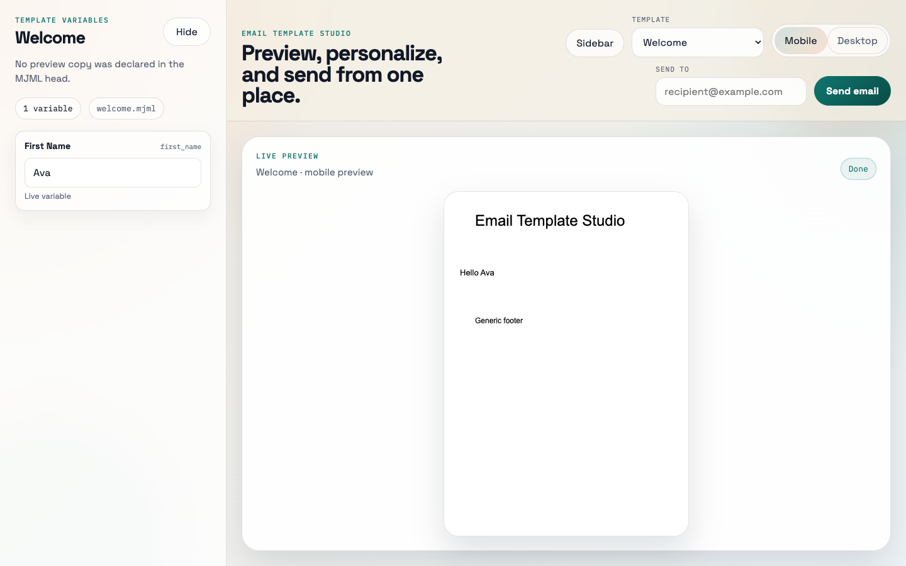
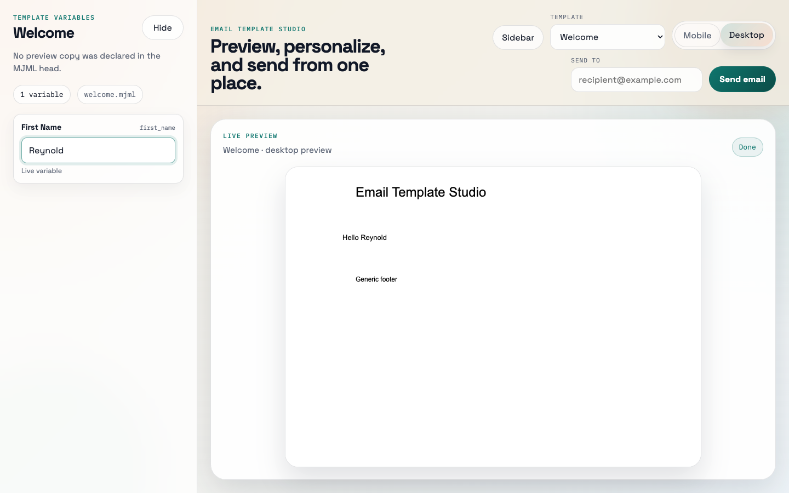
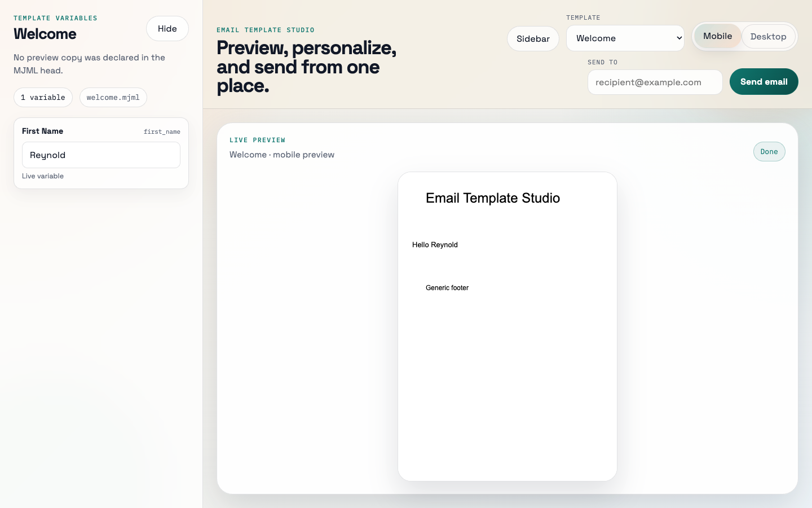

# Email Template Studio

> A local-first, file-based toolkit for building, previewing, validating, and test-sending **MJML** email templates — with reusable components, variable extraction, and a clean studio UI.



---

## Why this exists

Transactional emails are usually wrangled in one of two ways: hand-written HTML that breaks in Outlook, or proprietary editors that lock your templates inside an ESP. Email Template Studio is the middle path:

- Templates are **plain MJML files** in your repo — review them in PRs, version them in git, share components across projects.
- Previews run **locally** — no SaaS, no telemetry, no waiting for someone to refresh a staging environment.
- Test sends use **your own SMTP** — fake servers in CI, real ones during QA, never coupled to a specific provider.
- The engine ships as a **library** (`@email-template-studio/core`) so it can drive a CLI, a studio app, or your own internal tooling.

If you've ever copy-pasted MJML between projects, lost track of which template uses `{{ first_name }}` vs `{{ user.name }}`, or wanted Storybook-but-for-emails — this is for you.

---

## Features

- **MJML authoring** with `mj-include` partials and shared styles
- **Variable extraction** — `{{ expression }}` placeholders parsed automatically into typed metadata (key, label, default)
- **Live preview** — desktop and phone modes, re-renders on variable edit
- **Test send** over SMTP — recipient configurable per-send, transport via env
- **Build** — compile every template to `dist/<id>.html`
- **Validate** — project structure and template syntax checks
- **Reusable starter blocks** — `header`, `footer`, `button`, `section`, `spacer`
- **CLI** — `dev`, `build`, `watch`, `send`, `validate`
- **Browser studio** — React + Vite, served by an Express API

---

## Screenshots

| Desktop preview | Variable editing | Phone preview |
| --- | --- | --- |
|  |  |  |

---

## Quick start (from zero)

### Prerequisites

- **Node.js ≥ 22**
- **pnpm ≥ 10** (`npm i -g pnpm@10`)

### Run the studio against the bundled example

```bash
git clone https://github.com/your-org/email-template-studio.git
cd email-template-studio
pnpm install
pnpm dev:studio
```

Open <http://127.0.0.1:3100>. You should see the studio with four sample templates from `examples/basic`: **Welcome**, **Reset Password**, **Notification**, **Invoice**.

That's it — pick a template, type a value in the Variables panel, watch the preview update.

### Use it in your own project

```bash
# inside your existing repo
pnpm add -D @email-template-studio/cli @email-template-studio/core
```

Create a config and a first template:

```bash
mkdir -p src/{pages,components,styles}
```

`email-template-studio.config.ts`:

```ts
export default {
  pagesDir: 'src/pages',
  componentsDir: 'src/components',
  stylesDir: 'src/styles',
  outDir: 'dist',
};
```

`src/pages/welcome.mjml`:

```mjml
<mjml>
  <mj-body>
    <mj-section>
      <mj-column>
        <mj-text>Hi {{ first_name }}, welcome aboard!</mj-text>
      </mj-column>
    </mj-section>
  </mj-body>
</mjml>
```

Then:

```bash
pnpm exec email-template-studio dev       # opens the studio against your project
pnpm exec email-template-studio build     # compiles to dist/*.html
pnpm exec email-template-studio validate  # checks structure
```

---

## Project layout

When you author templates in your own repo, the conventional layout is:

```text
your-project/
├── email-template-studio.config.ts   # optional — defaults shown below
└── src/
    ├── pages/         # one .mjml file per email template
    │   ├── welcome.mjml
    │   ├── reset-password.mjml
    │   └── invoice.mjml
    ├── components/    # reusable MJML partials, included via <mj-include>
    │   ├── header.mjml
    │   └── footer.mjml
    └── styles/        # shared MJML attributes / styles
        └── base.mjml
```

Defaults if you omit the config: `src/pages`, `src/components`, `src/styles`, `dist`.

### How to create a new email

1. **Add a file** under `src/pages/`. The filename (without `.mjml`) becomes the template **id**: `src/pages/order-confirmation.mjml` → id `order-confirmation`, label `Order Confirmation`.
2. **Include shared partials** with `<mj-include path="../components/header.mjml" />` and shared styles with `<mj-include path="../styles/base.mjml" />` inside `<mj-head>`.
3. **Use variables** anywhere with double-brace syntax: `{{ first_name }}`, `{{ user.email }}`, `{{ order.total }}`. The studio extracts them automatically and gives each one a form field with a sample default.
4. **Refresh the studio** (or restart `pnpm dev:studio`). The new template appears in the sidebar.

Example template using a partial and a variable:

```mjml
<mjml>
  <mj-head>
    <mj-include path="../styles/base.mjml" />
  </mj-head>
  <mj-body>
    <mj-include path="../components/header.mjml" />
    <mj-section>
      <mj-column>
        <mj-text>Hello {{ first_name }}, your order #{{ order_id }} ships tomorrow.</mj-text>
      </mj-column>
    </mj-section>
    <mj-include path="../components/footer.mjml" />
  </mj-body>
</mjml>
```

### What are components?

Components are **plain MJML fragments** (not full documents) that you include in pages. They keep visual style consistent across templates and let you change the header once instead of in twenty files.

A component file contains MJML fragments — usually a `<mj-section>`, `<mj-button>`, or similar block — without the outer `<mjml>` / `<mj-body>` wrapper. For example, `src/components/header.mjml`:

```mjml
<mj-section padding="24px">
  <mj-column>
    <mj-text font-size="24px">Acme Co.</mj-text>
  </mj-column>
</mj-section>
```

The `@email-template-studio/components` package ships a small starter kit (`header`, `footer`, `button`, `section`, `spacer`) you can copy into your project as a starting point.

---

## Variables

Any `{{ expression }}` in a template becomes a variable. The extractor produces:

| Field | Example input | Example output |
| --- | --- | --- |
| `expression` | raw text inside braces | `user.first_name` |
| `key` | normalized snake_case | `user_first_name` |
| `label` | Title Case for forms | `User First Name` |
| `defaultValue` | sample value for preview | `Sample User First Name` |

The studio renders one form field per unique variable. The values you type are passed into the renderer and SMTP send.

---

## CLI

The CLI lives in `@email-template-studio/cli`. Run it via `pnpm exec` (or alias `email-template-studio`):

| Command | What it does |
| --- | --- |
| `email-template-studio dev` | Start the studio (web + API) against the current project |
| `email-template-studio build` | Compile all templates to `outDir` as HTML |
| `email-template-studio watch` | Same as `build`, but re-runs on file changes |
| `email-template-studio validate` | Verify the project structure and template syntax |
| `email-template-studio send --to <addr> --template <id>` | Render and SMTP-send a single template |

---

## SMTP configuration

`send` reads SMTP settings from environment variables. Copy `examples/basic/.env.example` to `.env` and fill in your credentials:

```ini
SMTP_HOST=smtp.example.com
SMTP_PORT=587
SMTP_SECURE=false
SMTP_USER=your-user
SMTP_PASS=your-pass
SMTP_FROM=studio@example.com
```

For local testing, use a fake SMTP server (we recommend [Ethereal](https://ethereal.email/) or [MailHog](https://github.com/mailhog/MailHog)). **Never commit `.env`.**

---

## Architecture at a glance

```text
apps/studio/          React + Vite UI + Express API
packages/core/        Engine: config, discovery, variables, render, build, validate, send
packages/cli/         Terminal commands wrapping `core`
packages/components/  Optional starter MJML blocks
examples/basic/       Reference project (the studio's default target)
```

Strict boundaries:

- `core` has no UI and no CLI concerns. It's a pure file-system-driven library.
- `cli` is a thin layer over `core`.
- `apps/studio` consumes `core` through an HTTP API — never duplicating compile logic.

Full details: see **[docs/GUIDE.md](docs/GUIDE.md)**.

---

## Public API (core)

```ts
import {
  loadConfig,
  discoverTemplates,
  extractVariables,
  interpolateVariables,
  renderPreview,
  buildAllTemplates,
  validateTemplateProject,
  sendTestEmail,
} from '@email-template-studio/core';
```

Types: `TemplateProjectConfig`, `TemplateDescriptor`, `TemplateVariable`, `BuildResult`, `TransportConfig`.

---

## Packages

| Package | Status | Purpose |
| --- | --- | --- |
| `@email-template-studio/core` | published | Engine, library API |
| `@email-template-studio/cli` | published | Command-line tool |
| `@email-template-studio/components` | private (V1) | Starter MJML blocks |
| `@email-template-studio/studio` | not published | Reference studio app |

---

## Development

```bash
pnpm install
pnpm dev:studio       # studio + API at :3100 / :3101
pnpm test             # unit + integration (Vitest)
pnpm test:e2e         # browser tests (Playwright)
pnpm build            # build every package
pnpm typecheck
pnpm lint
pnpm format
```

---

## Contributing

We welcome PRs, issues, and ideas. Start with **[CONTRIBUTING.md](CONTRIBUTING.md)** for the contributor workflow, code conventions, commit format, and release process.

---

## Roadmap

See **[docs/GUIDE.md → Roadmap](docs/GUIDE.md#roadmap)** for what's planned and what's intentionally out of scope.

---

## Security

Found a vulnerability? Please report it privately first — see **[docs/GUIDE.md → Security](docs/GUIDE.md#security)**.

---

## License

MIT
